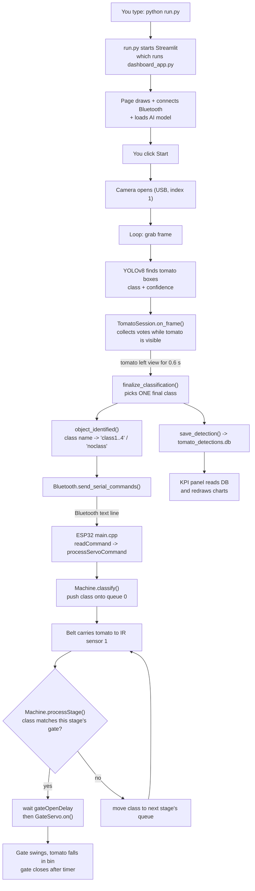
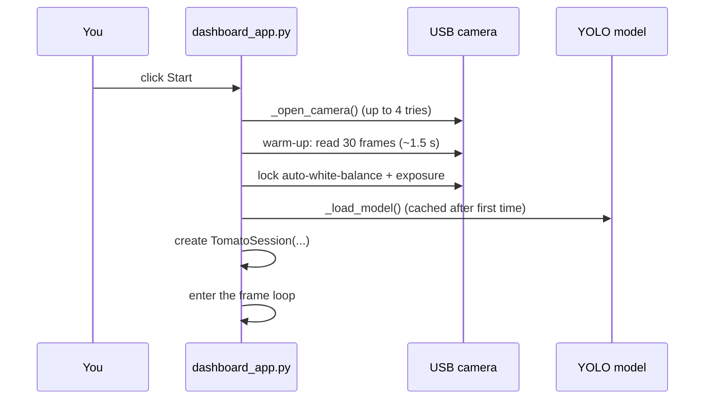
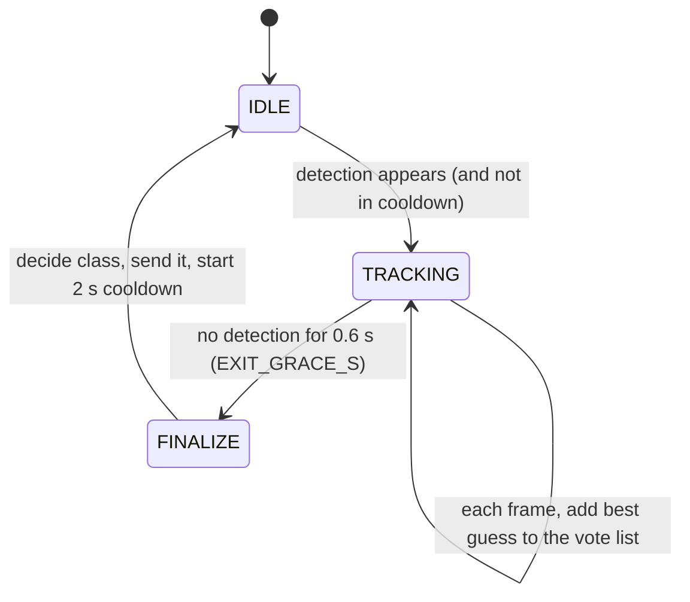

# How the Tomato Sorter Works — Step by Step (Explained Simply)

This guide follows **one tomato** from the moment you type `python run.py` until a little
gate flips and the tomato drops into the right bin. Every step names the **file** and the
**function** that does the work, and shows **what data is passed** along.

> Companion docs: `SYSTEM_DOCUMENTATION.md` (reference), `NEW_LAPTOP_SETUP.md` (installing).
> This file is the "explain it to me like I'm new" version. Everything here was written by
> reading the actual code (Python repo + `tomato_V2` ESP32 firmware repo).

---

## 0. The story in one minute

Imagine a **fruit sorting post office**:

| Real thing | Post-office picture |
|---|---|
| The **camera + AI** (Python laptop) | A clerk who looks at each parcel and writes a **label**: "green", "red", "defect"… |
| **Bluetooth** | The clerk **shouts the label** across the room to the ESP32. |
| The **ESP32** (a small computer on the machine) | A **line-up manager**. He writes each label on a list in the order shouted. He does **not** act yet. |
| The **IR sensors** (invisible beams) | **Doorbells**. When a tomato walks past one, it rings. |
| The **gates** (servo motors) | **Trapdoors**. When the right doorbell rings for the right label, the trapdoor opens and the tomato falls into its bin. |
| The **database** | A **notebook** where the clerk writes a tally of every tomato, for the statistics page. |

The big trick to remember: **the laptop never opens a gate. It only says the label.**
The ESP32 opens gates by itself, using the doorbells.

---

## 1. Meet the files (the cast)

### 1a. Python side — folder `Tomato_Projet_five_class--Deplyment-Model--Tomato-Research--/`

| File | Job (kid version) | Important names inside |
|---|---|---|
| `run.py` | The **"start button"** for the whole app. | `main()` |
| `dashboard_app.py` | **The app you see.** Shows the camera, buttons, charts. Also the "conductor" that runs the whole loop. | `_open_camera()`, `_load_model()`, `_connect_bluetooth()`, `object_identified()`, `render_kpis()`, the main `while` loop |
| `conveyor_core.py` | The **brain**: decides *"is this really one tomato, and what is its final class?"* | `TomatoSession`, `finalize_classification()`, `list_available_models()`, settings like `EXIT_GRACE_S` |
| `bluetooth_sender.py` | The **walkie-talkie**: finds the ESP32 and sends it text commands. | `Bluetooth` class, `send_serial_commands()`, `_connect()`, `_probe_port()`, `_listen_loop()` |
| `database.py` | The **notebook**: saves each tomato, and computes statistics. | `save_detection()`, `get_statistics()`, `SHELF_LIFE` |
| `microcontroller_config.py` | The **settings sheet** for the hardware link (device name, baud). | `BLUETOOTH_DEVICE_NAME = "TomatoSorter"` |
| `runs_local/tomato_5class_v6_balanced/weights/best.pt` | The **trained AI model** (YOLOv8). | loaded by `_load_model()` |
| `tomato_detections.db` | The notebook file itself (SQLite). | table `detections` |

### 1b. ESP32 side — folder `Documents\PlatformIO\Projects\tomato_V2\`

| File | Job (kid version) |
|---|---|
| `src/main.cpp` | The **boss loop**. Sets everything up once (`setup()`), then repeats forever (`loop()`): read commands, spin motor, check sensors, move gates. |
| `lib/Machine/` | The **line-up manager**: 4 waiting lists + the rule "when a doorbell rings, look at the list". *Most important file on the hardware side.* |
| `lib/IRSensor/` | One **doorbell**. Cleans up flickery signals ("debounce"). |
| `lib/GateServo/` | One **trapdoor**. `on()` swings it open, then it closes itself after a timer. |
| `lib/Bluetooth/` | Thin wrapper that makes the ESP32 appear as **"TomatoSorter"** over Bluetooth. |
| `lib/StepperMotor/` | Drives the **conveyor belt motor**. |
| `lib/Potentiometer/` | The **speed knob** for the belt. |
| `lib/Settings/Settings.h` | One list of **all adjustable numbers** (angles, delays…). |

> The folder `esp32_firmware/` inside the Python repo is an **old** attempt. It is not what runs
> on the board. Ignore it.

---

## 2. The whole journey on one picture



---

## 3. Step 1 — `python run.py`

**File:** `run.py` → function `main()`

It does one thing:

```python
subprocess.call([sys.executable, "-m", "streamlit", "run", str(APP_FILE)], cwd=APP_FILE.parent)
```

Plain words: *"Python, please start Streamlit (a tool that turns a Python file into a web page)
and point it at `dashboard_app.py`."* `cwd=` makes the working folder the project folder, so
relative paths (like `runs_local/...` and `tomato_detections.db`) work.

Streamlit prints `Local URL: http://localhost:8501`. Open that in a browser.

> **Why not just `streamlit run`?** On this setup the `streamlit.exe` wrapper can exit silently.
> `python -m streamlit` doesn't.

---

## 4. Step 2 — The page is built (`dashboard_app.py`, top to bottom)

**The most important idea about Streamlit:** every time you click *anything*, Streamlit runs the
**whole file again from the top**. Things that must not be repeated (loading the AI, connecting
Bluetooth) are wrapped in `@st.cache_resource` so they happen **once** and are remembered.

In order, the file does this:

1. **Imports & settings** — `CAMERA_INDEX = 1` (the USB camera; index 0 was the laptop's own
   camera), class colours, etc. Imports `TomatoSession` etc. from `conveyor_core.py`.
2. **`_connect_bluetooth()`** (cached) — creates `Bluetooth()` from `bluetooth_sender.py`.
   Result: `bluetooth` object, or a red error banner *"Bluetooth: 'TomatoSorter' not found…"*.
   See Step 8 for how it finds the port.
3. **Session memory** — `st.session_state` keeps values between reruns:
   `streaming` (True/False), `session_tomato_count`, `session_class_counts`, `last_classified`.
4. **Controls drawn** — model dropdown (from `list_available_models()` which scans
   `runs_local/*/weights/best.pt`), confidence slider (default `0.45`), buttons
   **Test camera / Start / Stop / Reset ESP32 queue**.
5. **Empty boxes ("placeholders")** reserved for the video frame, the live stats, and the KPI
   charts. Later the loop fills them in-place, so the page doesn't jump around.
6. **`render_kpis()`** draws the statistics once (reads the DB — see Step 10).
7. **The main loop** runs **only if** `st.session_state.streaming` is `True` — i.e. after you
   click **Start**.

---

## 5. Step 3 — You click **Start**

Clicking sets `st.session_state.streaming = True`, Streamlit reruns the file, and this time
the main loop block executes.



Details:

- **`_open_camera()`** — tries `cv2.VideoCapture(CAMERA_INDEX)` up to 4 times, waiting between
  tries, because Windows' DirectShow driver is moody. Returns the open camera.
- **Warm-up** — reads ~30 frames so the camera's auto-exposure settles, then **locks**
  white-balance/exposure (`CAP_PROP_AUTO_WB`, `CAP_PROP_AUTO_EXPOSURE`). Why? If colour keeps
  drifting, a *red* tomato could look *orange* and be mis-sorted. If this fails 10 times in a
  row you get the "Camera driver hiccup" message.
- **Model choice** — `device = "cuda" if torch.cuda.is_available() else "cpu"` (this laptop:
  CPU). `_load_model()` loads `best.pt` once and caches it.
- **`TomatoSession(scheduler, on_finalized=_on_finalized, ...)`** is created. `_on_finalized` is
  a small function the brain will call when a tomato is decided (Step 6).

---

## 6. Step 4 — The frame loop (runs many times per second)

Inside `while st.session_state.streaming:` — each lap handles **one camera picture**:

```text
frame = cap.read()                         # 1. take a photo (a big grid of pixels)
results = model(frame, conf=0.45, imgsz=640)   # 2. ask the AI: "what tomatoes do you see?"
detections = [ {"class": "red", "conf": 0.93}, ... ]   # 3. tidy the answer into a simple list
session.on_frame(detections)               # 4. give the list to the brain
draw boxes + "State: TRACKING/IDLE"        # 5. paint on the picture
frame_placeholder.image(frame_rgb)         # 6. show it on the web page
update "This session" stats, refresh KPI ~1×/sec
```

**Data shape at each hop**

| Hop | What the data looks like |
|---|---|
| Camera → Python | `frame`: a NumPy array (height × width × 3 colours) |
| Model → Python | `results[0].boxes`: each box has `cls` (0–4), `conf` (0–1), `xyxy` (corners) |
| Python → brain | `detections`: `[{"class": "red", "conf": 0.93}]` — **only class+confidence**, no positions |

The five classes (cls id → name from the model): `green`, `breaker`, `turning`, `red`, `defect`.
- **green** = unripe, **breaker** = starting to change, **turning** = ~30–80% red,
  **red** = fully ripe, **defect** = cracked/bruised/rotten.

> Note: the dashboard does not use the "COCO distractor filter" that exists in `conveyor_core.py`
> (it was built for filtering bottles/phones but isn't called here).

---

## 7. Step 5 — The brain: `TomatoSession` (`conveyor_core.py`)

**Problem:** the AI gives a guess **every frame**, and guesses can flicker
(red, red, turning, red…). But one physical tomato must produce **exactly one** command.

**Solution:** a two-state machine — **IDLE** (nothing there) and **TRACKING** (a tomato is in view).



`on_frame(detections)`, each frame:

- **Something detected & IDLE** → if not in the post-finalize cooldown, switch to TRACKING and
  start an empty list `votes`.
- **Something detected & TRACKING** → take the **single most confident** detection and append
  `(class, conf)` to `votes`. (The belt is single-file, so we assume one tomato at a time.)
- **Nothing detected & TRACKING** → if it's been **0.6 s** since last seen, the tomato has left:
  call `_finalize()`.

`_finalize()`:

1. Stop tracking; start a **2.0 s cooldown** (`REACQUIRE_COOLDOWN_S`) so a hand flicking past or a
   glitch can't be counted as a *second* tomato. (A double count would shift the ESP32's list
   for every tomato after it — see Step 9.)
2. If fewer than **2 frames** (`MIN_FRAMES_TO_COUNT`) → ignore, it was noise.
3. `finalize_classification(votes)` picks the winner.

### How the winner is chosen — `finalize_classification()`

Example: `votes = [("red",.9), ("red",.95), ("turning",.5), ("red",.92)]`

1. **Defect override first:** if `defect` votes with confidence ≥ **0.80** exist in **≥ 2 frames**
   *and* make up **≥ 35 %** of all frames → answer is `defect`, no matter what else.
2. Otherwise **confidence-weighted vote**: add up confidence per class
   (red = .9+.95+.92 = 2.77, turning = .5) → **red wins**, average confidence = 0.92.
3. If only weak defect votes existed and nothing else → discard (returns `None`).

Then, still inside `_finalize()`:

```text
save_detection(id, "red", 0.92, tab_source="dashboard")   → database
print("[CLASSIFY] RED (conf=0.92, n_frames=12) shelf_life=12d")
self.on_finalized("red", 0.92, 12)                        → back into dashboard_app
```

> **Legacy leftover you'll see in the console:** `_finalize()` also calls
> `scheduler.schedule(...)`, and the dashboard's `SerialSender` is created with
> `force_simulated=True`, so you may see lines like `[SCHEDULE] red gate fire in 3.50s` and
> `[SIMULATED] Would fire gate=red`. **These do nothing.** They belong to an older timer-based
> design (before IR sensors). The real gate control is Steps 7–9.

---

## 8. Step 6 — From class name to a command: `object_identified()`

Back in `dashboard_app.py`, `_on_finalized` runs:

```python
object_identified(final_class)            # send to hardware
st.session_state.session_tomato_count += 1  # update on-screen counters
...
```

`object_identified(class_name)` is a tiny translator:

| AI class | Command sent | Meaning on the ESP32 |
|---|---|---|
| `green` | `class1` | belongs to gate 1 |
| `breaker` | `class2` | gate 2 |
| `turning` | `class3` | gate 3 |
| `red` | `class4` | gate 4 |
| `defect` | `noclass` | **no gate** — rides to the end and drops off |

Then it calls `bluetooth.send_serial_commands(command)`.

---

## 9. Step 7 — Talking over Bluetooth (`bluetooth_sender.py`)

### 9a. Finding the ESP32 (happens once at startup)

Windows makes a paired Bluetooth device look like a normal **COM port** (e.g. `COM4`). But *which*
COM port? Class `Bluetooth._connect()` figures it out:

1. `_candidate_ports()` lists serial ports that look like Bluetooth.
2. For each one, `_probe_port()` (run in its **own thread**, max 6 s, because unreachable
   Bluetooth ports can hang Windows) opens it, sends `noclass`, and reads the reply.
3. If the reply contains `"tomato queue"` (or starts with `ACK`/`EVT`) → that's the ESP32.
   Save it in `self.conn`, set `connected = True`, print `[BLUETOOTH] Connected on COMx`.
4. Start a background thread `_listen_loop()` that prints anything the ESP32 says on its own as
   `[BLUETOOTH RX] ...`.

If nothing answers → `connected = False`, the red banner appears, and any send just prints
`[SIMULATED] Would send 'class4'`. The dashboard still works, minus real gates.

> **Gotcha found while reading the code:** the probe command `noclass` is a *real* command — the
> ESP32 pushes a `0` onto its first list. So after connecting, a stray `0` may already be waiting
> in the queue and be popped by the first real tomato, shifting things. **Press "Reset ESP32
> queue" after connecting** (and between test runs) to be safe.

### 9b. Sending one command

`send_serial_commands("class4")`:

```python
with self._io_lock:                      # only one thing talks on the wire at a time
    self.conn.reset_input_buffer()
    self.conn.write(b"class4\n")         # text + newline
    reply = self.conn.readline()         # wait for the ESP32's answer
print("[BLUETOOTH] Sent 'class4' -> ACK tomato queue -> gate4:[4] gate3:[] gate2:[] gate1:[]")
```

The `_io_lock` stops the listener thread and the sender from stealing each other's bytes.

---

## 10. Step 8 — Inside the ESP32 (`tomato_V2`)

### 10a. Boot — `setup()` in `main.cpp` (runs once)
Starts USB serial (115200), starts Bluetooth named **"TomatoSorter"**, starts the motor, the speed
knob, 4 servos, 4 IR sensors, and the `Machine`; registers `onQueueChanged` so the queue
status is printed to USB **and** Bluetooth whenever it changes; applies `Settings`.

### 10b. Forever — `loop()` (thousands of times per second)

```text
readCommand(Serial) + readCommand(bluetooth)   # any new text line? -> processServoCommand()
motor.run(potentiometer speed); motor.update() # keep the belt turning
applySpeedAdaptiveGateTiming()                 # adjust gate timing to belt speed
servo1..4.update()                             # close gates whose timer expired
ir1..4.update()                                # read + debounce doorbells
machine.update()                               # THE sorting logic
```

The ESP32 never "waits" — it just spins through this list over and over ("non-blocking").

### 10c. A command arrives

`readCommand()` collects characters until `\n`, then `processServoCommand(line)` splits the words.
For `class4` it falls to the last branch → `machine.handleCommand("class4", seq)`.

Other commands it understands: `reset`, `on 1 3` (test-swing gates), `ang a b c d` (set angles),
`set gateOpenDelay 1500` (change a setting live), `get motor speed`.

### 10d. `Machine` — the four waiting lists

`Machine` holds **4 FIFO queues** (first in, first out; capacity 8 each), one per IR sensor
position along the belt, **closest to the camera first**:

| Stage (queue #) | IR sensor | Gate it controls | Class it accepts |
|---|---|---|---|
| 0 | IR-wire-1 | servo4 (gate 4) | class 4 (red) |
| 1 | IR-wire-2 | servo3 (gate 3) | class 3 (turning) |
| 2 | IR-wire-3 | servo2 (gate 2) | class 2 (breaker) |
| 3 | IR-wire-4 | servo1 (gate 1) | class 1 (green) |

(The numbering is *mirrored* on purpose — it matches how the rig was physically wired.)

- `classify(n)` = **push `n` onto queue 0**, then reply `ACK tomato queue -> …`. Nothing moves yet.
- `update()` → `processStage(stage)` for every stage, each lap:
  - IR pin uses a pull-up: **1 = clear, 0 = tomato present**.
  - On a **falling edge** (1 → 0 = tomato just arrived) → **pop** the front of *that stage's* queue:
    - **Class matches this stage's gate** → mark the gate as pending, to open at
      `now + gateOpenDelay`.
    - **Doesn't match** and not the last stage → **push it onto the next stage's queue**.
    - **`0` (noclass)** or mismatch at the last stage → **dropped** (tomato just rides off).
    - Send an `EVT …` status line.
- `checkPendingGates()` → when a pending gate's time arrives → `GateServo.on()`.

### Worked example — 3 tomatoes: `red`, `green`, `defect`

Commands arrive in order: `class4`, `class1`, `noclass`.

```text
After sending:   Q0(IR1)=[4,1,0]   Q1=[]  Q2=[]  Q3=[]

Red tomato hits IR1:   pop 4. Stage 0 accepts class 4 → match!
                       gate4 opens after delay -> RED falls in bin 4.      Q0=[1,0]

Green tomato hits IR1: pop 1. Stage 0 wants 4 → no match → push to Q1.     Q0=[0]  Q1=[1]
Green hits IR2:        pop 1. Stage 1 wants 3 → no match → push to Q2.     Q1=[]   Q2=[1]
Green hits IR3:        pop 1. Stage 2 wants 2 → no match → push to Q3.     Q2=[]   Q3=[1]
Green hits IR4:        pop 1. Stage 3 wants 1 → match → gate1 opens. GREEN in bin 1.

Defect hits IR1:       pop 0 (noclass) → dropped. No gate. It rides to the end and drops off.
```

**Why order is everything:** the queue has **no idea which tomato is which** — it just trusts the
order. If Python sends one command too many, too few, or in the wrong order, *every* gate after
that is off by one. That's why `TomatoSession` has the 0.6 s grace and 2 s cooldown, and why
there's a **Reset ESP32 queue** button (`reset` command empties all queues).

### 10e. Reliability extras (sequence numbers)
`class1 42` — the trailing number lets a sender detect lost replies; if the ESP32 sees the same
number twice it re-sends `ACK` without queuing the tomato again. The current Python code sends
**without** a number (works fine in practice); the ESP32 side is ready if you want stricter
delivery later.

---

## 11. Step 9 — The gate opens (`GateServo`)

`Machine.checkPendingGates()` → `GateServo.on()`:

```cpp
_servo.write(_onAngle);   // swing open (default 110°)
_isOn = true; _onSince = millis();
```

Each `loop()`, `GateServo.update()` checks the clock; after `gateOnDurationMs` it does
`_servo.write(_initialAngle)` (default 180° = closed) and clears `_isOn`.

**Timing numbers** (`lib/Settings/Settings.h`):

| Setting | Default | Meaning |
|---|---|---|
| `gateInitialAngle` | 180 | closed position |
| `gateOnAngle` | 110 | open position |
| `gateOnDurationMs` | 2000 | how long it stays open (at full belt speed) |
| `gateOpenDelayMs` | 2000 | wait from IR trigger until opening (at full speed) |
| `gateOpenDelayTrimMs` | −500 | fine-tune added on top (so effectively 1500 ms) |
| `speedAdaptiveGateTiming` | true | scale timings by belt speed |

**Speed-adaptive:** `applySpeedAdaptiveGateTiming()` compares current belt speed to max
(`ratio` clamped 0.1–1.0). Slower belt → **shorter open time** and **longer delay** (tomatoes take
longer to reach the gate).

**Belt & knob:** `Potentiometer.getStepperSpeed()` reads GPIO34 and maps it to 0–2000
steps/sec; `StepperMotor.run(speed)` converts that to a pulse interval and toggles the step pin
in `update()` (DM542 driver).

**Pins (from `main.cpp`):** stepper 25/26 · pot 34 · servos 13, 12, 14, 27 · IR sensors 18, 19, 21, 23.

---

## 12. Step 10 — The notebook & the charts (`database.py`)

- **When saved:** once per finalized tomato, from `TomatoSession._finalize()` →
  `save_detection(detection_id, class_name, confidence, tab_source)`.
  The shelf life is looked up from `SHELF_LIFE` = `green 31, breaker 29, turning 24, red 12, defect 0` days.
- **Table `detections`:** `id, detection_id, class_name, confidence, shelf_life, timestamp, tab_source` (+ unused bbox columns).
- **When read:** `render_kpis()` in `dashboard_app.py` calls `get_statistics(time_window_minutes)`
  (~once/second while streaming) → totals, class counts, defect ratio, average shelf life,
  throughput, 20 latest rows → shown as metrics, a pie chart, and a table.

---

## 13. Cheat sheet — "what form is the data in right now?"

| # | Where | Data |
|---|---|---|
| 1 | Camera | pixel array |
| 2 | YOLO output | boxes: class id, confidence, corners |
| 3 | `on_frame` input | `[{"class":"red","conf":0.93}]` |
| 4 | Inside `TomatoSession` | `votes = [("red",.9),("red",.95),…]` |
| 5 | After `finalize_classification` | `("red", 0.92)` |
| 6 | To database | row: `det_ab12cd34, red, 0.92, 12, time, dashboard` |
| 7 | After `object_identified` | text `"class4"` |
| 8 | Over Bluetooth | bytes `class4\n` |
| 9 | ESP32 queue | integer `4` pushed onto `Queue[0]` |
| 10 | ESP32 reply | text `ACK tomato queue -> gate4:[4] gate3:[] gate2:[] gate1:[]` |
| 11 | IR falling edge | pop → compare → gate pending / next queue / drop |
| 12 | Servo | angle 110° for ~2 s, then 180° |

---

## 14. Known limitation: timing race

The ESP32 only sorts correctly if the class is **already in its queue before the tomato reaches
IR sensor 1**. The laptop deliberately waits 0.6 s after the tomato leaves the camera view, then
adds Bluetooth delay. If the belt is fast and the camera is close to IR-1, the command arrives
late and the ordering breaks. Fixes: move the camera further upstream, slow the belt, or
finalize earlier (see `SYSTEM_DOCUMENTATION.md` §7).

---

## 15. Where do I change…?

| I want to… | Change this |
|---|---|
| Use a different camera | `CAMERA_INDEX` in `dashboard_app.py` |
| Make detection stricter/looser | confidence slider (default `CONFIDENCE_THRESHOLD = 0.45` in `conveyor_core.py`) |
| Wait longer before deciding a tomato left | `EXIT_GRACE_S` in `conveyor_core.py` |
| Stop double-counting | `REACQUIRE_COOLDOWN_S` in `conveyor_core.py` |
| Change how defect is decided | `DEFECT_OVERRIDE_*` constants in `conveyor_core.py` |
| Change which model runs | `MODEL_PATH` in `conveyor_core.py` (or dropdown) |
| Change class → gate command mapping | `object_identified()` in `dashboard_app.py` |
| Change Bluetooth name | `BLUETOOTH_DEVICE_NAME` (Python) **and** `Bluetooth bluetooth("TomatoSorter")` in `main.cpp` |
| Adjust when/how long gates open | `set gateOpenDelay …` / `set gateOnDuration …` live, or `Settings.h` |
| Adjust gate angles | `set gateOnAngle …`, `set gateInitialAngle …` |
| Change shelf-life days | `SHELF_LIFE` in `database.py` |
| Change IR/gate wiring order | `Machine.cpp` constructor (`_ir`, `_gate`, `_classAt`) |

---

## 16. Old/unused code (don't be confused)

- `SerialSender`, `EventScheduler`, `GATE_DISTANCES_CM`, `BELT_SPEED_CMS` — older timer-based
  design; the dashboard runs them in simulated mode only. The "placeholder values" warning
  refers to these.
- `conveyor_integration.py` — old command-line runner using the old `G/B/T/R` protocol. Not used.
- COCO distractor filter (`get_distractor_boxes`) — exists but isn't called by the dashboard.
- `esp32_firmware/` in the Python repo — old firmware. Real firmware is `tomato_V2`.
- Parts of `microcontroller_config.py` (pin numbers, `G/B/T/R` letters, `COM4`) describe that old
  design; `main.cpp` is the truth for pins.

---

## 17. Mini glossary

- **YOLOv8** — an AI that finds objects in a picture and labels them with a confidence.
- **Confidence** — how sure the AI is (0 = no idea, 1 = certain).
- **Frame** — one picture from the camera video.
- **Streamlit** — turns a Python file into a web page.
- **Bluetooth SPP** — Bluetooth pretending to be a serial (text) cable.
- **Queue / FIFO** — a line where the first one in is the first one out.
- **IR sensor** — infrared beam that "rings" when something blocks it.
- **Servo** — a motor that turns to an exact angle (used for gates).
- **Debounce** — ignoring very fast flickers of a signal so noise isn't mistaken for an event.
- **Falling edge** — the exact moment a signal changes from 1 to 0 (tomato arrives).
- **ACK / EVT** — ESP32 message tags: *ACK* = reply to your command, *EVT* = it reporting by itself.
